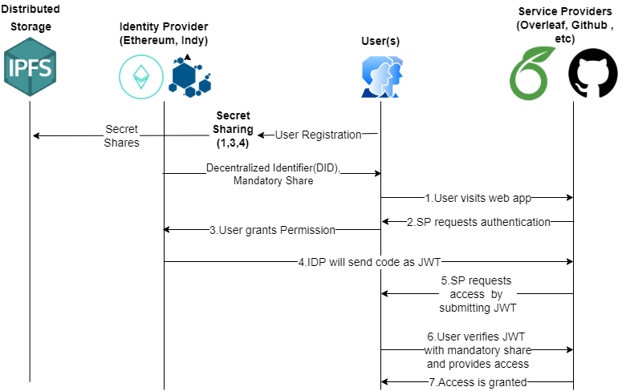

# DAuth: Distributed OAuth using Decentralized Identifiers with Secret Sharing 
   

## Abstract 

## Proposed Architecture 

## Demo
[Click here]() to access the webpage.

## Acknowledgement
We would like to acknowldge the support provided by **TIFAC-CORE in Cyber Security**, Amrita School of Engineering, Amrita Vishwa Vidyapeetham, Coimbatore, India in carrying out this work as part of "**M.Tech Cyber Security**" Thesis. 

#### Guide : Dr. K. Praveen, Assistant Professor, TIFAC-CORE in Cyber Security, ASE - Coimbatore
#### Co-Guide : Mr. Ramaguru Radhakrishnan, Assistant Professor, TIFAC-CORE in Cyber Security, ASE - Coimbatore

## References
- Ramaguru R., Sindhu M., Sethumadhavan M. (2019) Blockchain for the Internet of Vehicles. In: Singh M., Gupta P., Tyagi V., Flusser J., Ören T., Kashyap R. (eds) Advances in Computing and Data Sciences. ICACDS 2019. Communications in Computer and Information Science, vol 1045. Springer, Singapore. https://doi.org/10.1007/978-981-13-9939-8_37
- Thomas A.M., Ramaguru R., Sethumadhavan M. (2022) Distributed Identity and Verifiable Claims Using Ethereum Standards. In: Ranganathan G., Fernando X., Shi F. (eds) Inventive Communication and Computational Technologies. Lecture Notes in Networks and Systems, vol 311. Springer, Singapore. https://doi.org/10.1007/978-981-16-5529-6_48
- Taraka Rama Mokshagna Teja M., Praveen K. (2022) Prevention of Phishing Attacks Using QR Code Safe Authentication. In: Smys S., Balas V.E., Palanisamy R. (eds) Inventive Computation and Information Technologies. Lecture Notes in Networks and Systems, vol 336. Springer, Singapore. https://doi.org/10.1007/978-981-16-6723-7_27

## Publication
TBD 

